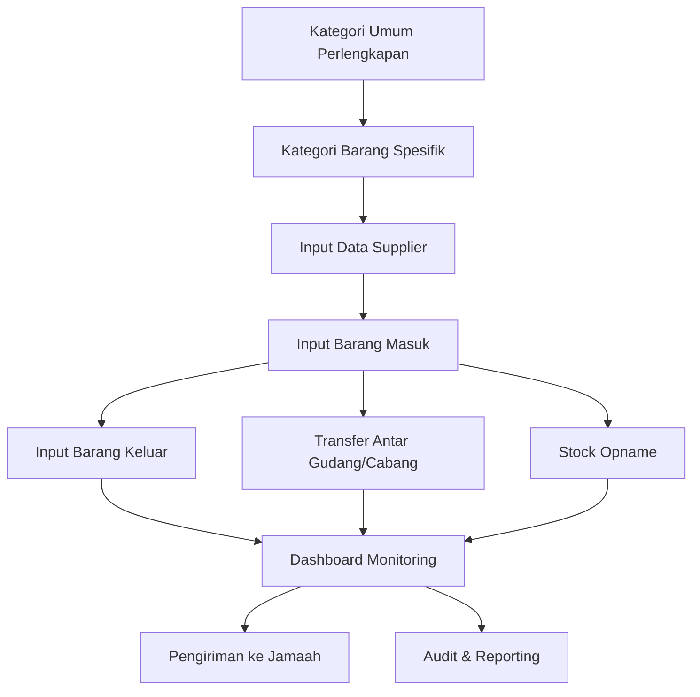

# Purchasing & Logistics Context Engineering

Dokumen ini adalah acuan final untuk pengembangan fitur purchasing dan logistik di Rahmah Travel, termasuk penyesuaian multi-gudang, multi-cabang, dan relasi ke table `branches`.

---

## 1. Struktur Tabel Utama

### 1.1. purchasing_categories
- Menyimpan kategori global perlengkapan (misal: perlengkapan umroh).
- Field: `id`, `name`, `created_at`, `updated_at`

### 1.2. jenis_barang
- Menyimpan kategori spesifik perlengkapan (misal: jaket, jilbab).
- Field: `id`, `nama_jenis`, `deskripsi`, `created_at`, `updated_at`

### 1.3. purchasing_suppliers
- Data supplier barang.
- Field: `id`, `name`, `phone`, `supplier_link`, `created_at`, `updated_at`, `items`

### 1.4. purchasing_barang
- Data inventory barang.
- Field: `id_barang`, `category_id`, `id_jenis_barang`, `kode_barang`, `nama_barang`, `satuan`, `stock_minimal`, `stock_akhir`, `created_at`, `updated_at`, `is_required`, `is_dynamic`, `size_type`

### 1.5. purchasing_item_units
- Menyimpan detail unit barang per supplier.
- Field: `id`, `id_barang`, `id_supplier`, `invoice_tagihan`, `no_invoice`, `harga_invoice`, `jumlah_order`, `jumlah_dibayar`, `jumlah_masuk`, `file_pembayaran`, `user_id`, `created_at`, `updated_at`

### 1.6. stock_opname_session & stock_opname
- Menyimpan sesi dan detail stock opname.
- Field: 
  - `stock_opname_session`: `id`, `session_name`, `tanggal_mulai`, `tanggal_selesai`, `status`, `user_id`, `total_items`, `total_scanned`, `keterangan`, `created_at`, `updated_at`, `warehouse_id`, `branch_id`
  - `stock_opname`: `id`, `session_id`, `id_barang`, `jumlah`, `no_seri_unit`, `tanggal_stockopname`, `status`, `user_id`, `keterangan`, `created_at`, `updated_at`, `warehouse_id`, `rack_id`, `bin_id`, `unit_id`, `branch_id`

### 1.7. purchasing_barang_keluar & purchasing_incoming
- Barang keluar/masuk.
- Field: 
  - `purchasing_barang_keluar`: `id`, `id_barang`, `jumlah_keluar`, `tanggal_keluar`, `keterangan`, `created_at`, `updated_at`, `unit_ids`, `warehouse_id`, `rack_id`, `bin_id`, `branch_id`
  - `purchasing_incoming`: `id_masuk`, `id_barang`, `jumlah`, `tanggal_masuk`, `supplier`, `no_invoice`, `user_id`, `created_at`, `supplier_id`, `warehouse_id`, `rack_id`, `bin_id`, `branch_id`

### 1.8. purchasing_rejects
- Barang yang ditolak.
- Field: `id`, `id_barang`, `jumlah`, `alasan`, `tanggal_reject`, `user_id`, `created_at`, `branch_id`

### 1.9. purchasing_public_docs, request_perlengkapan, jamaah_kelengkapan, jamaah_kelengkapan_items
- Data pengiriman, request perlengkapan, dan checklist kelengkapan jamaah.
- Field: Lihat detail pada struktur tabel di atas.

### 1.10. rekap_ongkir
- Rekap ongkir pengiriman.
- Field: `id`, `order_id`, `kelengkapan_id`, `nominal`, `bukti_tf`, `mutasi`, `status`, `created_at`, `updated_at`

---

## 2. Penambahan Tabel Baru dan sudah ada di dalam database(Multi-Gudang & Multi-Cabang)

### 2.1. warehouse_locations
- Menyimpan lokasi gudang (HQ, Cabang), relasi ke `branches`.
- table 'warehouse_locations' :
	1	id Primary	int			No	None		AUTO_INCREMENT	Change Change	Drop Drop	
	2	kode_lokasi Index	varchar(50)	utf8mb4_general_ci		No	None			Change Change	Drop Drop	
	3	nama_lokasi	varchar(255)	utf8mb4_general_ci		No	None			Change Change	Drop Drop	
	4	tipe_lokasi	enum('HQ', 'Branch', 'Transit')	utf8mb4_general_ci		Yes	Branch			Change Change	Drop Drop	
	5	alamat	text	utf8mb4_general_ci		Yes	NULL			Change Change	Drop Drop	
	6	telepon	varchar(20)	utf8mb4_general_ci		Yes	NULL			Change Change	Drop Drop	
	7	pic	varchar(255)	utf8mb4_general_ci		Yes	NULL			Change Change	Drop Drop	
	8	branch_id Index	int			Yes	NULL			Change Change	Drop Drop	
	9	created_at	timestamp			Yes	CURRENT_TIMESTAMP		DEFAULT_GENERATED	Change Change	Drop Drop	
	10	updated_at	timestamp		on update CURRENT_TIMESTAMP	Yes	CURRENT_TIMESTAMP		DEFAULT_GENERATED ON UPDATE CURRENT_TIMESTAMP	Change Change	Drop Drop	


### 2.2. warehouse_racks
- Menyimpan rak di dalam gudang.
- table 'warehouse_racks' :
	1	id Primary	int			No	None		AUTO_INCREMENT	Change Change	Drop Drop	
	2	warehouse_id Index	int			No	None			Change Change	Drop Drop	
	3	kode_rak	varchar(50)	utf8mb4_general_ci		No	None			Change Change	Drop Drop	
	4	nama_rak	varchar(255)	utf8mb4_general_ci		No	None			Change Change	Drop Drop	
	5	deskripsi	text	utf8mb4_general_ci		Yes	NULL			Change Change	Drop Drop	
	6	kapasitas_berat_kg	decimal(10,2)			Yes	NULL			Change Change	Drop Drop	
	7	created_at	timestamp			Yes	CURRENT_TIMESTAMP		DEFAULT_GENERATED	Change Change	Drop Drop	
	8	updated_at	timestamp		on update CURRENT_TIMESTAMP	Yes	CURRENT_TIMESTAMP		DEFAULT_GENERATED ON UPDATE CURRENT_TIMESTAMP	Change Change	Drop Drop	


### 2.3. warehouse_bins
- Menyimpan bin di dalam rak.
- table 'warehouse_bins' :
	1	id Primary	int			No	None		AUTO_INCREMENT	Change Change	Drop Drop	
	2	rack_id Index	int			No	None			Change Change	Drop Drop	
	3	kode_bin	varchar(50)	utf8mb4_general_ci		No	None			Change Change	Drop Drop	
	4	nama_bin	varchar(255)	utf8mb4_general_ci		No	None			Change Change	Drop Drop	
	5	level_posisi	int			Yes	NULL			Change Change	Drop Drop	
	6	kolom_posisi	varchar(10)	utf8mb4_general_ci		Yes	NULL			Change Change	Drop Drop	
	7	kapasitas_item	int			Yes	NULL			Change Change	Drop Drop	
	8	created_at	timestamp			Yes	CURRENT_TIMESTAMP		DEFAULT_GENERATED	Change Change	Drop Drop	
	9	updated_at	timestamp		on update CURRENT_TIMESTAMP	Yes	CURRENT_TIMESTAMP		DEFAULT_GENERATED ON UPDATE CURRENT_TIMESTAMP	Change Change	Drop Drop	


### 2.4. warehouse_stock
- Menyimpan stok barang per lokasi, rak, bin, unit, dan cabang.
- table 'warehouse_stock' :
1	id Primary	int			No	None		AUTO_INCREMENT	Change Change	Drop Drop	
	2	id_barang Index	int			No	None			Change Change	Drop Drop	
	3	warehouse_id Index	int			No	None			Change Change	Drop Drop	
	4	rack_id Index	int			Yes	NULL			Change Change	Drop Drop	
	5	bin_id Index	int			Yes	NULL			Change Change	Drop Drop	
	6	unit_id Index	int			Yes	NULL			Change Change	Drop Drop	
	7	branch_id Index	int			Yes	NULL			Change Change	Drop Drop	
	8	quantity	int			Yes	0			Change Change	Drop Drop	
	9	reserved_qty	int			Yes	0			Change Change	Drop Drop	
	10	available_qty	int			Yes	0			Change Change	Drop Drop	
	11	last_movement_date	timestamp			Yes	NULL			Change Change	Drop Drop	
	12	created_at	timestamp			Yes	CURRENT_TIMESTAMP		DEFAULT_GENERATED	Change Change	Drop Drop	
	13	updated_at	timestamp		on update CURRENT_TIMESTAMP	Yes	CURRENT_TIMESTAMP		DEFAULT_GENERATED ON UPDATE CURRENT_TIMESTAMP	Change Change	Drop Drop	


### 2.5. stock_movements
- Log pergerakan stok (IN/OUT/TRANSFER/ADJUSTMENT/OPNAME).
- table 'stock_movements' :
1	id Primary	int			No	None		AUTO_INCREMENT	Change Change	Drop Drop	
	2	id_barang Index	int			No	None			Change Change	Drop Drop	
	3	warehouse_id Index	int			No	None			Change Change	Drop Drop	
	4	rack_id Index	int			Yes	NULL			Change Change	Drop Drop	
	5	bin_id Index	int			Yes	NULL			Change Change	Drop Drop	
	6	unit_id Index	int			Yes	NULL			Change Change	Drop Drop	
	7	branch_id Index	int			Yes	NULL			Change Change	Drop Drop	
	8	movement_type	enum('IN', 'OUT', 'TRANSFER', 'ADJUSTMENT', 'OPNAME')	utf8mb4_general_ci		No	None			Change Change	Drop Drop	
	9	reference_type	enum('INCOMING', 'OUTGOING', 'TRANSFER', 'ADJUSTMENT', 'OPNAME')	utf8mb4_general_ci		No	None			Change Change	Drop Drop	
	10	reference_id	int			Yes	NULL			Change Change	Drop Drop	
	11	quantity_before	int			Yes	0			Change Change	Drop Drop	
	12	quantity_change	int			No	None			Change Change	Drop Drop	
	13	quantity_after	int			Yes	0			Change Change	Drop Drop	
	14	movement_date Index	timestamp			Yes	CURRENT_TIMESTAMP		DEFAULT_GENERATED	Change Change	Drop Drop	
	15	notes	text	utf8mb4_general_ci		Yes	NULL			Change Change	Drop Drop	
	16	user_id	int			Yes	NULL			Change Change	Drop Drop	
	17	created_at	timestamp			Yes	CURRENT_TIMESTAMP		DEFAULT_GENERATED	Change Change	Drop Drop	


### 2.6. warehouse_transfers & warehouse_transfer_items
- Transfer barang antar lokasi/cabang.
- table 'warehouse_transfers' :
1	id Primary	int			No	None		AUTO_INCREMENT	Change Change	Drop Drop	
	2	transfer_number Index	varchar(100)	utf8mb4_general_ci		No	None			Change Change	Drop Drop	
	3	from_warehouse_id Index	int			No	None			Change Change	Drop Drop	
	4	to_warehouse_id Index	int			No	None			Change Change	Drop Drop	
	5	from_branch_id Index	int			Yes	NULL			Change Change	Drop Drop	
	6	to_branch_id Index	int			Yes	NULL			Change Change	Drop Drop	
	7	transfer_date	date			No	None			Change Change	Drop Drop	
	8	status	enum('draft', 'pending', 'in_transit', 'received', 'cancelled')	utf8mb4_general_ci		Yes	draft			Change Change	Drop Drop	
	9	requested_by	int			Yes	NULL			Change Change	Drop Drop	
	10	approved_by	int			Yes	NULL			Change Change	Drop Drop	
	11	approved_at	timestamp			Yes	NULL			Change Change	Drop Drop	
	12	shipped_by	int			Yes	NULL			Change Change	Drop Drop	
	13	shipped_at	timestamp			Yes	NULL			Change Change	Drop Drop	
	14	received_by	int			Yes	NULL			Change Change	Drop Drop	
	15	received_at	timestamp			Yes	NULL			Change Change	Drop Drop	
	16	notes	text	utf8mb4_general_ci		Yes	NULL			Change Change	Drop Drop	
	17	created_at	timestamp			Yes	CURRENT_TIMESTAMP		DEFAULT_GENERATED	Change Change	Drop Drop	
	18	updated_at	timestamp		on update CURRENT_TIMESTAMP	Yes	CURRENT_TIMESTAMP		DEFAULT_GENERATED ON UPDATE CURRENT_TIMESTAMP	Change Change	Drop Drop	


  - table 'warehouse_transfer_items' :
  1	id Primary	int			No	None		AUTO_INCREMENT	Change Change	Drop Drop	
	2	transfer_id Index	int			No	None			Change Change	Drop Drop	
	3	id_barang Index	int			No	None			Change Change	Drop Drop	
	4	unit_id Index	int			Yes	NULL			Change Change	Drop Drop	
	5	from_rack_id	int			Yes	NULL			Change Change	Drop Drop	
	6	from_bin_id	int			Yes	NULL			Change Change	Drop Drop	
	7	to_rack_id	int			Yes	NULL			Change Change	Drop Drop	
	8	to_bin_id	int			Yes	NULL			Change Change	Drop Drop	
	9	quantity_requested	int			No	None			Change Change	Drop Drop	
	10	quantity_shipped	int			Yes	0			Change Change	Drop Drop	
	11	quantity_received	int			Yes	0			Change Change	Drop Drop	
	12	notes	text	utf8mb4_general_ci		Yes	NULL			Change Change	Drop Drop	
	13	created_at	timestamp			Yes	CURRENT_TIMESTAMP		DEFAULT_GENERATED	Change Change	Drop Drop	
	14	updated_at	timestamp		on update CURRENT_TIMESTAMP	Yes	CURRENT_TIMESTAMP		DEFAULT_GENERATED ON UPDATE CURRENT_TIMESTAMP	Change Change	Drop Drop	


---

## 3. Relasi ke Table branches

- Setiap lokasi gudang (`warehouse_locations`) dan transaksi barang keluar/masuk/transfer harus memiliki kolom `branch_id` yang merujuk ke table `branches`.
- Dengan ini, data barang dan stok **terlihat jelas di cabang mana**.

---

## 4. Flow Fitur

### 4.1. Struktur Gudang Multi-Level
- Barang disimpan dan dicatat hingga level bin, sehingga pencarian dan stock opname lebih akurat.
- Setiap lokasi gudang terhubung ke cabang.

### 4.2. Multi-Lokasi & Multi-Cabang Stok
- Setiap barang memiliki stok per lokasi (HQ/Cabang), rak, bin, dan unit.
- Dashboard stok menampilkan distribusi stok seluruh lokasi dan cabang.

### 4.3. Transfer Antar Lokasi/Cabang
- Barang bisa dipindahkan antar lokasi/cabang, dengan log status (draft, pending, in transit, received).
- Transfer harus di-approve dan dicatat siapa yang melakukan.

### 4.4. Stock Opname Per Lokasi/Cabang
- Sesi opname bisa dilakukan per lokasi, rak, bin, unit, dan cabang.
- Jumlah barang yang di-scan dan hasil opname dicatat.

### 4.5. Log Pergerakan Stok
- Setiap perubahan stok (masuk, keluar, transfer, opname, adjustment) dicatat di `stock_movements` untuk audit dan tracking.

### 4.6. Integrasi ke Purchasing & Pengiriman
- Barang masuk/keluar harus dicatat lokasi dan cabang detailnya.
- Pengiriman ke jamaah bisa diambil dari lokasi/cabang tertentu.

---

## 5. Contoh Flow

1. **Barang masuk:** Supplier mengirim barang → dicatat di `purchasing_incoming` → stok bertambah di `warehouse_stock` pada lokasi, rak, bin, dan cabang tertentu.
2. **Barang keluar:** Barang diambil untuk pengiriman → dicatat di `purchasing_barang_keluar` → stok berkurang di lokasi, rak, bin, dan cabang terkait.
3. **Transfer antar cabang:** Barang dipindahkan dari HQ ke Cabang → dibuat entry di `warehouse_transfers` dan `warehouse_transfer_items` → stok berkurang di HQ, bertambah di Cabang.
4. **Stock opname:** Tim melakukan opname di lokasi/cabang tertentu → hasil dicatat di `stock_opname_session` dan `stock_opname`.
5. **Dashboard monitoring:** Admin melihat distribusi stok seluruh lokasi dan cabang, status stok minimal, dan histori pergerakan barang.

---

## 6. Manfaat

- **Akurasi stok:** Tracking hingga level bin/rak/cabang.
- **Transparansi distribusi:** Stok per cabang/gudang terlihat jelas.
- **Audit trail:** Semua pergerakan barang tercatat.
- **Efisiensi operasional:** Picking, packing, dan transfer lebih mudah.

---

## 7. ERD (Entity Relationship Diagram) - Mermaid

```mermaid
erDiagram
    branches {
        int id PK
        string name
        string address
        string phone
        datetime created_at
        datetime updated_at
    }
    purchasing_categories {
        int id PK
        string name
        datetime created_at
        datetime updated_at
    }
    jenis_barang {
        int id PK
        string nama_jenis
        string deskripsi
        datetime created_at
        datetime updated_at
    }
    purchasing_suppliers {
        int id PK
        string name
        string phone
        string supplier_link
        datetime created_at
        datetime updated_at
        string items
    }
    purchasing_barang {
        int id_barang PK
        int category_id FK
        int id_jenis_barang FK
        string kode_barang
        string nama_barang
        string satuan
        int stock_minimal
        int stock_akhir
        datetime created_at
        datetime updated_at
        tinyint is_required
        tinyint is_dynamic
        enum size_type
    }
    warehouse_locations {
        int id PK
        string location_code
        string location_name
        enum location_type
        string address
        string phone
        string pic_name
        string pic_phone
        int branch_id FK
        bool is_active
        datetime created_at
        datetime updated_at
    }
    warehouse_racks {
        int id PK
        int warehouse_id FK
        string rack_code
        string rack_name
        string description
        decimal capacity_weight
        bool is_active
        datetime created_at
        datetime updated_at
    }
    warehouse_bins {
        int id PK
        int rack_id FK
        string bin_code
        string bin_name
        int position_level
        char position_column
        int capacity_items
        bool is_active
        datetime created_at
        datetime updated_at
    }
    purchasing_item_units {
        int id PK
        int id_barang FK
        int id_supplier FK
        string invoice_tagihan
        string no_invoice
        decimal harga_invoice
        int jumlah_order
        int jumlah_dibayar
        int jumlah_masuk
        string file_pembayaran
        int user_id FK
        datetime created_at
        datetime updated_at
    }
    warehouse_stock {
        int id PK
        int id_barang FK
        int warehouse_id FK
        int rack_id FK
        int bin_id FK
        int unit_id FK
        int branch_id FK
        int quantity
        int reserved_qty
        int available_qty
        datetime last_movement_date
        datetime created_at
        datetime updated_at
    }
    purchasing_incoming {
        int id_masuk PK
        int id_barang FK
        int jumlah
        date tanggal_masuk
        string supplier
        string no_invoice
        int user_id FK
        datetime created_at
        int supplier_id FK
    }
    purchasing_barang_keluar {
        int id PK
        int id_barang FK
        int jumlah_keluar
        date tanggal_keluar
        string keterangan
        datetime created_at
        datetime updated_at
        int unit_ids
    }
    warehouse_transfers {
        int id PK
        string transfer_number
        int from_warehouse_id FK
        int to_warehouse_id FK
        int from_branch_id FK
        int to_branch_id FK
        date transfer_date
        enum status
        int requested_by FK
        int approved_by FK
        datetime approved_at
        int shipped_by FK
        datetime shipped_at
        int received_by FK
        datetime received_at
        string notes
        datetime created_at
        datetime updated_at
    }
    warehouse_transfer_items {
        int id PK
        int transfer_id FK
        int id_barang FK
        int unit_id FK
        int from_rack_id FK
        int from_bin_id FK
        int to_rack_id FK
        int to_bin_id FK
        int quantity_requested
        int quantity_shipped
        int quantity_received
        string notes
        datetime created_at
        datetime updated_at
    }
    stock_movements {
        int id PK
        int id_barang FK
        int warehouse_id FK
        int rack_id FK
        int bin_id FK
        int unit_id FK
        int branch_id FK
        enum movement_type
        enum reference_type
        int reference_id
        int quantity_before
        int quantity_change
        int quantity_after
        datetime movement_date
        string notes
        int user_id FK
        datetime created_at
    }
    stock_opname_session {
        int id PK
        string session_name
        date tanggal_mulai
        date tanggal_selesai
        enum status
        int user_id FK
        int total_items
        int total_scanned
        string keterangan
        datetime created_at
        datetime updated_at
    }
    stock_opname {
        int id PK
        int session_id FK
        int id_barang FK
        int jumlah
        string no_seri_unit
        date tanggal_stockopname
        enum status
        int user_id FK
        string keterangan
        datetime created_at
        datetime updated_at
    }
    purchasing_rejects {
        int id PK
        int id_barang FK
        int jumlah
        string alasan
        date tanggal_reject
        int user_id FK
        datetime created_at
    }
    purchasing_public_docs {
        int id PK
        int order_details_id FK
        string nama_penerima
        string nomor_telp
        string alamat_lengkap
        datetime created_at
        datetime updated_at
        int provinsi_id
        int kabupaten_id
        string kecamatan
        string kelurahan
    }
    request_perlengkapan {
        int id PK
        int public_docs_id FK
        enum status
        int requested_by FK
        datetime requested_at
        int confirmed_by FK
        datetime confirmed_at
        int finished_by FK
        datetime finished_at
        datetime created_at
        datetime updated_at
    }
    jamaah_kelengkapan {
        int id PK
        int order_details_id FK
        int id_barang FK
        string kepala_keluarga_id
        tinyint kain_ihram_mukena
        string ukuran_kain_ihram_mukena
        tinyint jilbab
        string ukuran_jilbab
        tinyint koper
        tinyint tas_paspor
        tinyint tas_serut
        string ukuran_tas_serut
        tinyint buku_doa
        tinyint jaket
        string ukuran_jaket
        tinyint syal
        enum status_pengambilan
        enum status_alamat
        enum ekspedisi
        enum status_pengiriman
        date tanggal_pengiriman
        string tracking_status
        string tracking_location
        text tracking_notes
        longtext tracking_history
        datetime last_tracked_at
        string no_resi
        timestamp tanggal_pengambilan
        text catatan
        timestamp created_at
        timestamp updated_at
        tinyint is_checked
    }
    jamaah_kelengkapan_items {
        int id PK
        int kelengkapan_id FK
        int barang_id FK
        int unit_id FK
        tinyint is_selected
        string ukuran
        timestamp created_at
        timestamp updated_at
        int jenis_barang_id FK
        tinyint is_stock_reduced
        timestamp stock_reduced_at
        int user_id FK
    }
    rekap_ongkir {
        int id PK
        int order_id FK
        int kelengkapan_id FK
        int nominal
        string bukti_tf
        string mutasi
        enum status
        timestamp created_at
        timestamp updated_at
    }

    branches ||--o{ warehouse_locations : "has"
    purchasing_categories ||--o{ purchasing_barang : "has"
    jenis_barang ||--o{ purchasing_barang : "has"
    purchasing_suppliers ||--o{ purchasing_item_units : "has"
    purchasing_barang ||--o{ purchasing_item_units : "has"
    purchasing_barang ||--o{ warehouse_stock : "has"
    warehouse_locations ||--o{ warehouse_racks : "has"
    warehouse_racks ||--o{ warehouse_bins : "has"
    warehouse_locations ||--o{ warehouse_stock : "has"
    warehouse_racks ||--o{ warehouse_stock : "has"
    warehouse_bins ||--o{ warehouse_stock : "has"
    purchasing_item_units ||--o{ warehouse_stock : "has"
    warehouse_locations ||--o{ warehouse_transfers : "from"
    warehouse_locations ||--o{ warehouse_transfers : "to"
    warehouse_transfers ||--o{ warehouse_transfer_items : "has"
    purchasing_barang ||--o{ warehouse_transfer_items : "has"
    warehouse_stock ||--o{ stock_movements : "has"
    purchasing_barang ||--o{ purchasing_barang_keluar : "has"
    warehouse_locations ||--o{ purchasing_barang_keluar : "has"
    warehouse_racks ||--o{ purchasing_barang_keluar : "has"
    warehouse_bins ||--o{ purchasing_barang_keluar : "has"
    purchasing_barang ||--o{ purchasing_incoming : "has"
    warehouse_locations ||--o{ purchasing_incoming : "has"
    warehouse_racks ||--o{ purchasing_incoming : "has"
    warehouse_bins ||--o{ purchasing_incoming : "has"
    purchasing_barang ||--o{ purchasing_rejects : "has"
    purchasing_public_docs ||--o{ request_perlengkapan : "has"
    request_perlengkapan ||--o{ jamaah_kelengkapan : "has"
    jamaah_kelengkapan ||--o{ jamaah_kelengkapan_items : "has"
    jamaah_kelengkapan ||--o{ rekap_ongkir : "has"
```




**ERD di atas sudah diurutkan sesuai urutan LRS dan menyesuaikan tabel yang sudah ada. Tabel yang sudah ada tidak diganti, hanya relasi dan urutan visualisasi yang diperjelas.**

---

## 8. Flowchart Diagram (Mermaid)



### Penjelasan Setiap Fitur/Step

1. **Kategori Umum Perlengkapan**
   - Membuat kategori global seperti "Perlengkapan Umroh", "Perlengkapan Haji", dll.
   - Tabel: `purchasing_categories`

2. **Kategori Barang Spesifik**
   - Membuat kategori barang detail seperti "Jaket", "Jilbab", "Koper", dll.
   - Tabel: `jenis_barang`

3. **Input Data Supplier**
   - Input data supplier yang menyediakan barang.
   - Tabel: `purchasing_suppliers`

4. **Input Barang Masuk**
   - Input barang yang diterima dari supplier, pilih kategori, jenis, supplier, lokasi gudang, rak, bin, dan cabang.
   - Tabel: `purchasing_incoming`, `warehouse_stock`

5. **Input Barang Keluar**
   - Input barang yang keluar untuk pengiriman, pengambilan, atau kebutuhan lain.
   - Tabel: `purchasing_barang_keluar`, `warehouse_stock`

6. **Transfer Antar Gudang/Cabang**
   - Proses transfer barang antar lokasi/cabang, update stok di masing-masing lokasi.
   - Tabel: `warehouse_transfers`, `warehouse_transfer_items`, `warehouse_stock`

7. **Stock Opname**
   - Proses pengecekan fisik stok barang di lokasi/cabang tertentu.
   - Tabel: `stock_opname_session`, `stock_opname`

8. **Dashboard Monitoring**
   - Monitoring stok, status barang, distribusi barang per lokasi/cabang, dan histori pergerakan barang.
   - Tabel: `warehouse_stock`, `stock_movements`

9. **Pengiriman ke Jamaah**
   - Proses pengiriman barang ke jamaah, update status pengiriman dan stok.
   - Tabel: `jamaah_kelengkapan`, `jamaah_kelengkapan_items`, `purchasing_barang_keluar`

10. **Audit & Reporting**
    - Audit trail dan reporting seluruh aktivitas barang, stok, dan transaksi.
    - Tabel: `stock_movements`, `warehouse_transfers`, `purchasing_incoming`, `purchasing_barang_keluar`

---

## 9. Logical Relationship Summary (LRS) - Urutan Pembuatan Tabel

1. **branches**
   - Master data cabang.
   - Flow: CRUD cabang (tambah, edit, hapus, list cabang), digunakan untuk relasi ke gudang dan transaksi.
2. **purchasing_categories**
   - Kategori umum perlengkapan.
   - Flow: CRUD kategori perlengkapan, digunakan saat input barang baru.
3. **jenis_barang**
   - Kategori barang spesifik.
   - Flow: CRUD jenis barang, dipilih saat input barang baru.
4. **purchasing_suppliers**
   - Data supplier barang.
   - Flow: CRUD supplier, relasi ke barang masuk dan item units.
5. **purchasing_barang**
   - Master data barang, relasi ke kategori dan jenis barang.
   - Flow: CRUD barang, input detail barang, relasi ke kategori dan jenis barang.
6. **warehouse_locations**
   - Lokasi gudang, relasi ke cabang.
   - Flow: CRUD lokasi gudang, pilih cabang, relasi ke rak dan stok.
7. **warehouse_racks**
   - Rak di dalam gudang, relasi ke lokasi gudang.
   - Flow: CRUD rak, pilih lokasi gudang, relasi ke bin dan stok.
8. **warehouse_bins**
   - Bin di dalam rak, relasi ke rak.
   - Flow: CRUD bin, pilih rak, relasi ke stok.
9. **purchasing_item_units**
   - Detail unit barang per supplier.
   - Flow: Input detail unit barang, relasi ke supplier dan barang.
10. **warehouse_stock**
    - Stok barang per lokasi, rak, bin, unit, dan cabang.
    - Flow: Update stok otomatis saat barang masuk/keluar/transfer/opname, monitoring stok real-time.
11. **purchasing_incoming**
    - Log transaksi barang masuk.
    - Flow: Input barang masuk, pilih supplier, barang, lokasi, rak, bin, update stok.
12. **purchasing_barang_keluar**
    - Log transaksi barang keluar.
    - Flow: Input barang keluar, pilih barang, lokasi, rak, bin, update stok.
13. **warehouse_transfers**
    - Log transfer barang antar lokasi/cabang.
    - Flow: Input transfer barang, pilih asal/tujuan lokasi, update stok di kedua lokasi.
14. **warehouse_transfer_items**
    - Detail item transfer.
    - Flow: Input detail barang yang ditransfer, jumlah, unit, rak, bin.
15. **stock_movements**
    - Log pergerakan stok (masuk, keluar, transfer, opname, adjustment).
    - Flow: Otomatis tercatat setiap ada perubahan stok, digunakan untuk audit dan reporting.
16. **stock_opname_session**
    - Sesi stock opname per lokasi/cabang.
    - Flow: Buat sesi opname, pilih lokasi/cabang, input hasil scan barang.
17. **stock_opname**
    - Detail hasil stock opname.
    - Flow: Input hasil scan barang, update status stok, monitoring selisih.
18. **purchasing_rejects**
    - Log barang yang ditolak.
    - Flow: Input barang yang ditolak, alasan, update status barang.
19. **purchasing_public_docs**
    - Data form alamat pengiriman jamaah.
    - Flow: Input/edit alamat pengiriman, relasi ke order/jamaah.
20. **request_perlengkapan**
    - Data request perlengkapan oleh jamaah.
    - Flow: Input request perlengkapan, proses approval dan pemenuhan.
21. **jamaah_kelengkapan**
    - Data kelengkapan yang didapat jamaah.
    - Flow: Input kelengkapan jamaah, update status pengambilan/pengiriman.
22. **jamaah_kelengkapan_items**
    - Checklist item kelengkapan jamaah.
    - Flow: Checklist item, update status pengambilan, tracking stok.
23. **rekap_ongkir**
    - Rekap ongkir pengiriman.
    - Flow: Input ongkir, upload bukti transfer, update status pembayaran ongkir.

---

**Setiap pembuatan tabel di atas diikuti dengan pembuatan fitur CRUD, input, monitoring, dan reporting sesuai kebutuhan bisnis dan relasi antar tabel.**

---

## 10. STANDARD DEVELOPMENT GUIDELINES & BEST PRACTICES

### 10.1. UI/UX Standards

#### A. Modal-Based CRUD Operations
**WAJIB**: Semua operasi CREATE dan EDIT harus menggunakan modal popup, TIDAK boleh redirect ke halaman baru.

**Struktur Modal Standard**:
```html
<!-- Modal Container -->
<div id="[module]Modal" class="hidden fixed inset-0 bg-black bg-opacity-50 z-50 flex items-center justify-center p-4">
  <div class="bg-white rounded-2xl shadow-2xl max-w-2xl w-full max-h-[90vh] overflow-y-auto">
    
    <!-- Modal Header dengan Gradient -->
    <div class="sticky top-0 bg-primary-gradient text-white px-6 py-4 flex justify-between items-center">
      <h2 id="modalTitle" class="text-xl font-bold">
        <i class="fas fa-[icon] mr-2"></i>Tambah [Nama Module]
      </h2>
      <button onclick="closeModal()" class="text-white hover:text-gray-200 transition">
        <i class="fas fa-times text-2xl"></i>
      </button>
    </div>

    <!-- Modal Body -->
    <form id="[module]Form" method="POST" data-ajax="true" class="p-6">
      <input type="hidden" id="[module]Id" name="id">
      
      <!-- Form Fields -->
      <div class="grid grid-cols-1 md:grid-cols-2 gap-4">
        
        <!-- Field Example -->
        <div>
          <label class="block text-sm font-semibold text-gray-700 mb-2">
            <i class="fas fa-[icon] mr-1 text-primary"></i>Label Field *
          </label>
          <input 
            type="text" 
            name="field_name" 
            id="field_name" 
            required 
            class="w-full px-4 py-2 border border-gray-300 rounded-lg focus:ring-2 focus:ring-primary focus:border-transparent transition"
            placeholder="Placeholder text">
        </div>

        <!-- Select Example -->
        <div>
          <label class="block text-sm font-semibold text-gray-700 mb-2">
            <i class="fas fa-list mr-1 text-primary"></i>Select Field *
          </label>
          <select 
            name="select_name" 
            id="select_name" 
            required 
            class="w-full px-4 py-2 border border-gray-300 rounded-lg focus:ring-2 focus:ring-primary focus:border-transparent transition">
            <option value="">Pilih Opsi</option>
            <!-- Options populated here -->
          </select>
        </div>

        <!-- Textarea Example -->
        <div class="md:col-span-2">
          <label class="block text-sm font-semibold text-gray-700 mb-2">
            <i class="fas fa-align-left mr-1 text-primary"></i>Textarea Field
          </label>
          <textarea 
            name="textarea_name" 
            id="textarea_name" 
            rows="3" 
            class="w-full px-4 py-2 border border-gray-300 rounded-lg focus:ring-2 focus:ring-primary focus:border-transparent transition"
            placeholder="Keterangan..."></textarea>
        </div>

      </div>

      <!-- Modal Footer dengan Action Buttons -->
      <div class="flex gap-3 mt-6 pt-6 border-t border-gray-200">
        <button 
          type="button" 
          onclick="closeModal()" 
          class="flex-1 px-6 py-3 bg-gray-100 text-gray-700 rounded-lg hover:bg-gray-200 transition font-medium">
          <i class="fas fa-times mr-2"></i>Batal
        </button>
        <button 
          type="submit" 
          class="flex-1 px-6 py-3 bg-primary-gradient text-white rounded-lg hover:from-primary-dark hover:to-primary transition font-medium shadow-lg">
          <i class="fas fa-save mr-2"></i>Simpan
        </button>
      </div>
    </form>

  </div>
</div>
```

**JavaScript Functions Standard**:
```javascript
// Open Create Modal
function openCreateModal() {
  document.getElementById('modalTitle').innerHTML = '<i class="fas fa-plus mr-2"></i>Tambah [Module]';
  document.getElementById('[module]Form').reset();
  document.getElementById('[module]Id').value = '';
  document.getElementById('[module]Form').action = '/[route]/[module]';
  document.getElementById('[module]Modal').classList.remove('hidden');
}

// Open Edit Modal
async function openEditModal(id) {
  try {
    const response = await fetch(`/[route]/[module]/${id}/data`);
    const data = await response.json();

    document.getElementById('modalTitle').innerHTML = '<i class="fas fa-edit mr-2"></i>Edit [Module]';
    document.getElementById('[module]Id').value = data.id;
    
    // Populate form fields
    document.getElementById('field_name').value = data.field_name || '';
    document.getElementById('select_name').value = data.select_name || '';
    // ... populate all fields
    
    document.getElementById('[module]Form').action = `/[route]/[module]/update/${id}`;
    document.getElementById('[module]Modal').classList.remove('hidden');
  } catch (error) {
    swalError('Gagal memuat data');
  }
}

// Close Modal
function closeModal() {
  document.getElementById('[module]Modal').classList.add('hidden');
  document.getElementById('[module]Form').reset();
}

// Delete with Confirmation
async function delete[Module](id) {
  swalConfirmFetch(
    `/[route]/[module]/delete/${id}`, 
    { method: 'POST' }, 
    '[Module] berhasil dihapus', 
    'Gagal menghapus [module]'
  );
}

// Close modal on ESC key
document.addEventListener('keydown', (e) => {
  if (e.key === 'Escape') closeModal();
});
```

---

#### B. SweetAlert2 Integration (WAJIB)
Setiap operasi CRUD harus menampilkan feedback menggunakan SweetAlert2.

**Success Notification**:
```javascript
// Automatic reload after success
swalSuccess('Data berhasil disimpan', true);

// Without reload (for custom handling)
swalSuccess('Data berhasil disimpan', false);
```

**Error Notification**:
```javascript
swalError('Gagal menyimpan data');
swalError(error.message); // With dynamic message
```

**Confirmation Dialog**:
```javascript
// Simple confirmation
swalConfirm('Hapus Data', 'Apakah Anda yakin ingin menghapus?', 'Ya, Hapus', () => {
  // Action on confirm
});

// Confirmation with Fetch
swalConfirmFetch(
  '/api/delete/123', 
  { method: 'POST' },
  'Data berhasil dihapus',
  'Gagal menghapus data'
);
```

**Helper Functions Available** (sudah ada di `views/partials/scripts.ejs`):
- `swalSuccess(message, reload = true)` - Success notification
- `swalError(message)` - Error notification
- `swalConfirm(title, text, confirmText, onConfirm)` - Confirmation dialog
- `swalConfirmFetch(url, options, successMsg, errorMsg, onSuccess)` - Fetch dengan konfirmasi
- `swalConfirmFormSubmit(form, text)` - Form submit dengan konfirmasi

---

#### C. AJAX Form Handling (WAJIB)
Semua form yang menggunakan modal HARUS menggunakan `data-ajax="true"` attribute.

**Form Attribute**:
```html
<form id="moduleForm" method="POST" data-ajax="true" action="/module/save">
  <!-- Form fields -->
</form>
```

**Automatic Handling**:
Form dengan `data-ajax="true"` akan otomatis di-handle oleh script di `views/partials/scripts.ejs`:
- Prevent default form submission
- Convert form data to JSON
- Send AJAX request dengan proper headers
- Show SweetAlert2 notification
- Auto reload on success

**Response Format dari Backend** (WAJIB):
```javascript
// Success Response
res.json({ 
  success: true,
  message: 'Data berhasil disimpan', // optional
  data: { ... } // optional
});

// Error Response
res.status(400).json({ 
  success: false,
  error: 'Error message here'
});
```

---

#### D. Table Structure Standard

**Responsive Table Container**:
```html
<div class="bg-white rounded-xl shadow-sm overflow-hidden">
  <div class="overflow-x-auto">
    <table class="min-w-full divide-y divide-gray-200">
      
      <!-- Table Header dengan Gradient -->
      <thead class="bg-primary-gradient text-white">
        <tr>
          <th class="px-6 py-4 text-left text-xs font-semibold uppercase tracking-wider">
            Column 1
          </th>
          <!-- More columns -->
          <th class="px-6 py-4 text-center text-xs font-semibold uppercase tracking-wider">
            Aksi
          </th>
        </tr>
      </thead>

      <!-- Table Body -->
      <tbody class="divide-y divide-gray-200">
        <% if (items && items.length > 0) { %>
          <% items.forEach((item, index) => { %>
            <tr class="hover:bg-gray-50 transition-colors">
              <td class="px-6 py-4 whitespace-nowrap">
                <%= item.field_name %>
              </td>
              <!-- More columns -->
              <td class="px-6 py-4 whitespace-nowrap text-center">
                <button 
                  onclick="openEditModal(<%= item.id %>)" 
                  class="text-blue-600 hover:text-blue-900 mr-3 transition"
                  title="Edit">
                  <i class="fas fa-edit text-lg"></i>
                </button>
                <button 
                  onclick="deleteItem(<%= item.id %>)" 
                  class="text-red-600 hover:text-red-900 transition"
                  title="Hapus">
                  <i class="fas fa-trash text-lg"></i>
                </button>
              </td>
            </tr>
          <% }); %>
        <% } else { %>
          <!-- Empty State -->
          <tr>
            <td colspan="[total_columns]" class="px-6 py-12 text-center">
              <i class="fas fa-inbox text-gray-300 text-6xl mb-4"></i>
              <p class="text-gray-500 text-lg">Belum ada data</p>
              <button 
                onclick="openCreateModal()" 
                class="mt-4 inline-flex items-center px-4 py-2 bg-primary text-white rounded-lg hover:bg-primary-dark transition">
                <i class="fas fa-plus mr-2"></i>Tambah Data Pertama
              </button>
            </td>
          </tr>
        <% } %>
      </tbody>

    </table>
  </div>
</div>
```

---

#### E. Search & Filter Standard

**Search Bar dengan Icon**:
```html
<div class="bg-white rounded-xl shadow-sm p-4 mb-6">
  <div class="flex flex-col md:flex-row gap-4">
    
    <!-- Search Input -->
    <div class="flex-1">
      <div class="relative">
        <i class="fas fa-search absolute left-3 top-1/2 transform -translate-y-1/2 text-gray-400"></i>
        <input 
          type="text" 
          id="searchInput" 
          placeholder="🔍 Cari data..." 
          class="w-full pl-10 pr-4 py-2 border border-gray-300 rounded-lg focus:ring-2 focus:ring-primary focus:border-transparent transition">
      </div>
    </div>

    <!-- Filter Dropdown (if needed) -->
    <div class="w-full md:w-64">
      <select 
        id="filterSelect" 
        class="w-full px-4 py-2 border border-gray-300 rounded-lg focus:ring-2 focus:ring-primary focus:border-transparent transition">
        <option value="">Semua Status</option>
        <option value="active">Aktif</option>
        <option value="inactive">Nonaktif</option>
      </select>
    </div>

    <!-- Add Button -->
    <button 
      onclick="openCreateModal()" 
      class="inline-flex items-center justify-center px-5 py-2 bg-primary-gradient text-white rounded-lg hover:from-primary-dark hover:to-primary transition-all shadow-md hover:shadow-lg whitespace-nowrap">
      <i class="fas fa-plus mr-2"></i>Tambah Data
    </button>

  </div>
</div>

<script>
// Search functionality
document.getElementById('searchInput').addEventListener('input', function() {
  const searchTerm = this.value.toLowerCase();
  const rows = document.querySelectorAll('tbody tr[data-searchable]');
  
  rows.forEach(row => {
    const text = row.textContent.toLowerCase();
    row.style.display = text.includes(searchTerm) ? '' : 'none';
  });
});

// Filter functionality
document.getElementById('filterSelect').addEventListener('change', function() {
  const filterValue = this.value;
  const rows = document.querySelectorAll('tbody tr[data-status]');
  
  rows.forEach(row => {
    if (!filterValue || row.dataset.status === filterValue) {
      row.style.display = '';
    } else {
      row.style.display = 'none';
    }
  });
});
</script>
```

**Make Rows Searchable**:
```html
<tr data-searchable data-status="<%= item.status %>">
  <!-- row content -->
</tr>
```

---

#### F. Status Badge Standard

**Badge Component**:
```html
<!-- Success/Active Badge -->
<span class="px-3 py-1 inline-flex items-center text-xs leading-5 font-semibold rounded-full bg-green-100 text-green-800">
  <i class="fas fa-check-circle mr-1"></i> Aktif
</span>

<!-- Warning Badge -->
<span class="px-3 py-1 inline-flex items-center text-xs leading-5 font-semibold rounded-full bg-yellow-100 text-yellow-800">
  <i class="fas fa-exclamation-circle mr-1"></i> Pending
</span>

<!-- Danger/Inactive Badge -->
<span class="px-3 py-1 inline-flex items-center text-xs leading-5 font-semibold rounded-full bg-red-100 text-red-800">
  <i class="fas fa-times-circle mr-1"></i> Nonaktif
</span>

<!-- Info Badge -->
<span class="px-3 py-1 inline-flex items-center text-xs leading-5 font-semibold rounded-full bg-blue-100 text-blue-800">
  <i class="fas fa-info-circle mr-1"></i> Draft
</span>
```

**Dynamic Badge dengan EJS**:
```html
<% if (item.status === 'active' || item.is_active == 1) { %>
  <span class="px-3 py-1 inline-flex items-center text-xs leading-5 font-semibold rounded-full bg-green-100 text-green-800">
    <i class="fas fa-check-circle mr-1"></i> Aktif
  </span>
<% } else { %>
  <span class="px-3 py-1 inline-flex items-center text-xs leading-5 font-semibold rounded-full bg-red-100 text-red-800">
    <i class="fas fa-times-circle mr-1"></i> Nonaktif
  </span>
<% } %>
```

---

#### G. Loading State Standard

**Button Loading State**:
```html
<button 
  type="submit" 
  id="submitBtn"
  class="px-6 py-3 bg-primary-gradient text-white rounded-lg transition">
  <span id="btnText">
    <i class="fas fa-save mr-2"></i>Simpan
  </span>
  <span id="btnLoading" class="hidden">
    <i class="fas fa-spinner fa-spin mr-2"></i>Menyimpan...
  </span>
</button>

<script>
// Show loading
function showLoading() {
  document.getElementById('btnText').classList.add('hidden');
  document.getElementById('btnLoading').classList.remove('hidden');
  document.getElementById('submitBtn').disabled = true;
}

// Hide loading
function hideLoading() {
  document.getElementById('btnText').classList.remove('hidden');
  document.getElementById('btnLoading').classList.add('hidden');
  document.getElementById('submitBtn').disabled = false;
}
</script>
```

**Page Loading Overlay**:
```html
<div id="loadingOverlay" class="hidden fixed inset-0 bg-black bg-opacity-50 z-50 flex items-center justify-center">
  <div class="bg-white rounded-lg p-6 flex flex-col items-center">
    <i class="fas fa-spinner fa-spin text-4xl text-primary mb-4"></i>
    <p class="text-gray-700 font-medium">Memuat data...</p>
  </div>
</div>

<script>
function showLoadingOverlay() {
  document.getElementById('loadingOverlay').classList.remove('hidden');
}

function hideLoadingOverlay() {
  document.getElementById('loadingOverlay').classList.add('hidden');
}
</script>
```

---

#### H. Responsive Design Standard

**Mobile-First Breakpoints**:
- **Mobile**: 320px - 767px (1 column layout)
- **Tablet**: 768px - 1023px (2 column layout)
- **Desktop**: 1024px+ (2-3 column layout)

**Grid Layout Example**:
```html
<div class="grid grid-cols-1 md:grid-cols-2 lg:grid-cols-3 gap-4">
  <!-- Items auto-adjust based on screen size -->
</div>
```

**Responsive Table to Cards**:
```html
<!-- Desktop: Table View -->
<div class="hidden md:block">
  <table class="min-w-full">
    <!-- Table content -->
  </table>
</div>

<!-- Mobile: Card View -->
<div class="md:hidden space-y-4">
  <% items.forEach(item => { %>
    <div class="bg-white rounded-lg shadow p-4">
      <div class="flex justify-between items-start mb-3">
        <h3 class="font-semibold text-lg"><%= item.nama %></h3>
        <span class="badge"><%= item.status %></span>
      </div>
      <div class="space-y-2 text-sm">
        <p><strong>Kode:</strong> <%= item.kode %></p>
        <p><strong>Deskripsi:</strong> <%= item.deskripsi %></p>
      </div>
      <div class="flex gap-2 mt-4 pt-4 border-t">
        <button onclick="openEditModal(<%= item.id %>)" class="flex-1 btn-secondary">
          <i class="fas fa-edit"></i> Edit
        </button>
        <button onclick="deleteItem(<%= item.id %>)" class="flex-1 btn-danger">
          <i class="fas fa-trash"></i> Hapus
        </button>
      </div>
    </div>
  <% }); %>
</div>
```

---

### 10.2. Backend Standards

#### A. Route Response Format (WAJIB)

**Success Response**:
```javascript
// For AJAX requests (JSON)
if (req.headers.accept && req.headers.accept.includes('application/json')) {
  return res.json({ 
    success: true,
    message: 'Data berhasil disimpan',
    data: { id: result.insertId, ...otherData }
  });
}

// For regular form submission (redirect)
res.redirect('/module/list');
```

**Error Response**:
```javascript
// For AJAX requests (JSON)
if (req.headers.accept && req.headers.accept.includes('application/json')) {
  return res.status(400).json({ 
    success: false,
    error: 'Error message here',
    details: errors // optional validation errors
  });
}

// For regular requests (render error page)
res.status(500).render('error', { 
  title: 'Error',
  error: error.message 
});
```

**Check Request Type Helper**:
```javascript
function isAjaxRequest(req) {
  return req.get('X-Requested-With') === 'XMLHttpRequest' || 
         (req.headers.accept && req.headers.accept.includes('application/json')) ||
         (req.headers['content-type'] && req.headers['content-type'].includes('application/json'));
}

// Usage in route
const isAjax = isAjaxRequest(req);
if (isAjax) {
  return res.json({ success: true });
} else {
  res.redirect('/list');
}
```

---

#### B. Input Validation Standard (WAJIB)

**Server-Side Validation**:
```javascript
const { body, validationResult } = require('express-validator');

// Validation rules
const moduleValidation = [
  body('field_name')
    .trim()
    .notEmpty().withMessage('Field wajib diisi')
    .isLength({ max: 255 }).withMessage('Maksimal 255 karakter'),
  
  body('numeric_field')
    .optional()
    .isInt({ min: 0 }).withMessage('Harus berupa angka positif'),
  
  body('date_field')
    .optional()
    .isISO8601().withMessage('Format tanggal tidak valid'),
  
  body('email_field')
    .optional()
    .isEmail().withMessage('Email tidak valid'),
];

// Apply validation in route
router.post('/module/save', moduleValidation, async (req, res) => {
  // Check validation errors
  const errors = validationResult(req);
  if (!errors.isEmpty()) {
    const isAjax = isAjaxRequest(req);
    if (isAjax) {
      return res.status(400).json({ 
        success: false,
        error: 'Validasi gagal',
        details: errors.array()
      });
    } else {
      return res.status(400).render('module/form', {
        errors: errors.array(),
        formData: req.body
      });
    }
  }
  
  // Proceed with saving data
  try {
    // ... save logic
    res.json({ success: true });
  } catch (error) {
    res.status(500).json({ success: false, error: error.message });
  }
});
```

**Client-Side Validation**:
```html
<input 
  type="text" 
  name="field_name" 
  required 
  minlength="3"
  maxlength="255"
  pattern="[A-Za-z0-9\s]+"
  title="Hanya alfanumerik dan spasi"
  class="form-input">

<script>
// Custom validation
document.getElementById('moduleForm').addEventListener('submit', function(e) {
  const field = document.getElementById('field_name');
  if (field.value.trim() === '') {
    e.preventDefault();
    swalError('Field tidak boleh kosong');
    field.focus();
    return false;
  }
});
</script>
```

---

#### C. Database Transaction Standard (WAJIB untuk operasi kompleks)

**Transaction Pattern**:
```javascript
router.post('/module/complex-operation', async (req, res) => {
  const connection = await db.getConnection();
  await connection.beginTransaction();

  try {
    // Step 1: Insert main record
    const [result1] = await connection.query(
      'INSERT INTO table1 (field1, field2) VALUES (?, ?)',
      [value1, value2]
    );
    const mainId = result1.insertId;

    // Step 2: Insert related records
    for (const item of items) {
      await connection.query(
        'INSERT INTO table2 (main_id, field) VALUES (?, ?)',
        [mainId, item.field]
      );
    }

    // Step 3: Update stock/other tables
    await connection.query(
      'UPDATE warehouse_stock SET quantity = quantity + ? WHERE id = ?',
      [quantity, stockId]
    );

    // Step 4: Log movement
    await connection.query(
      'INSERT INTO stock_movements (...) VALUES (...)',
      [...]
    );

    // Commit transaction
    await connection.commit();
    
    const isAjax = isAjaxRequest(req);
    if (isAjax) {
      res.json({ success: true, data: { id: mainId } });
    } else {
      res.redirect('/module/list');
    }

  } catch (error) {
    // Rollback on error
    await connection.rollback();
    console.error('Transaction error:', error);
    
    const isAjax = isAjaxRequest(req);
    if (isAjax) {
      res.status(500).json({ success: false, error: error.message });
    } else {
      res.status(500).render('error', { error: error.message });
    }
  } finally {
    connection.release();
  }
});
```

---

#### D. Cascade Dropdown API Standard

**API Endpoint Pattern**:
```javascript
// Get racks by warehouse
router.get('/api/warehouses/:id/racks', async (req, res) => {
  try {
    const [racks] = await db.query(`
      SELECT 
        r.*,
        COUNT(b.id) as total_bins,
        SUM(CASE WHEN b.is_active = 1 THEN 1 ELSE 0 END) as active_bins,
        wl.nama_lokasi as warehouse_name
      FROM warehouse_racks r
      LEFT JOIN warehouse_bins b ON r.id = b.rack_id
      LEFT JOIN warehouse_locations wl ON r.warehouse_id = wl.id
      WHERE r.warehouse_id = ? AND r.is_active = 1
      GROUP BY r.id
      ORDER BY r.kode_rak
    `, [req.params.id]);
    
    res.json({ success: true, data: racks });
  } catch (error) {
    res.status(500).json({ success: false, error: error.message });
  }
});

// Get bins by rack
router.get('/api/racks/:id/bins', async (req, res) => {
  try {
    const [bins] = await db.query(`
      SELECT 
        b.*,
        COALESCE(SUM(ws.quantity), 0) as current_stock,
        b.kapasitas_item as max_capacity,
        ROUND((COALESCE(SUM(ws.quantity), 0) / NULLIF(b.kapasitas_item, 0)) * 100, 2) as occupancy_percent,
        r.nama_rak as rack_name
      FROM warehouse_bins b
      LEFT JOIN warehouse_stock ws ON b.id = ws.bin_id
      LEFT JOIN warehouse_racks r ON b.rack_id = r.id
      WHERE b.rack_id = ? AND b.is_active = 1
      GROUP BY b.id
      ORDER BY b.level_posisi, b.kolom_posisi
    `, [req.params.id]);
    
    res.json({ success: true, data: bins });
  } catch (error) {
    res.status(500).json({ success: false, error: error.message });
  }
});
```

**Frontend Cascade Implementation**:
```javascript
// Warehouse change event
document.getElementById('warehouse_id').addEventListener('change', async function() {
  const warehouseId = this.value;
  const rackSelect = document.getElementById('rack_id');
  const binSelect = document.getElementById('bin_id');
  
  // Reset dependent dropdowns
  rackSelect.innerHTML = '<option value="">Pilih Rak</option>';
  binSelect.innerHTML = '<option value="">Pilih Bin</option>';
  rackSelect.disabled = !warehouseId;
  binSelect.disabled = true;
  
  if (!warehouseId) return;
  
  try {
    // Show loading
    rackSelect.innerHTML = '<option value="">Loading...</option>';
    
    const response = await fetch(`/api/warehouses/${warehouseId}/racks`);
    const result = await response.json();
    
    if (result.success && result.data) {
      rackSelect.innerHTML = '<option value="">Pilih Rak</option>';
      result.data.forEach(rack => {
        const occupancy = rack.active_bins > 0 
          ? `(${rack.active_bins}/${rack.total_bins} bins)` 
          : '(kosong)';
        const option = new Option(
          `${rack.kode_rak} - ${rack.nama_rak} ${occupancy}`,
          rack.id
        );
        rackSelect.add(option);
      });
    }
  } catch (error) {
    swalError('Gagal memuat data rak');
    rackSelect.innerHTML = '<option value="">Error loading</option>';
  }
});

// Rack change event
document.getElementById('rack_id').addEventListener('change', async function() {
  const rackId = this.value;
  const binSelect = document.getElementById('bin_id');
  
  binSelect.innerHTML = '<option value="">Pilih Bin</option>';
  binSelect.disabled = !rackId;
  
  if (!rackId) return;
  
  try {
    binSelect.innerHTML = '<option value="">Loading...</option>';
    
    const response = await fetch(`/api/racks/${rackId}/bins`);
    const result = await response.json();
    
    if (result.success && result.data) {
      binSelect.innerHTML = '<option value="">Pilih Bin</option>';
      result.data.forEach(bin => {
        const occupancy = bin.occupancy_percent 
          ? `${bin.occupancy_percent}% full` 
          : 'kosong';
        const icon = bin.occupancy_percent > 80 ? '🔴' : 
                     bin.occupancy_percent > 50 ? '🟡' : '🟢';
        const option = new Option(
          `${bin.kode_bin} - ${bin.nama_bin} (${occupancy}) ${icon}`,
          bin.id
        );
        binSelect.add(option);
      });
    }
  } catch (error) {
    swalError('Gagal memuat data bin');
    binSelect.innerHTML = '<option value="">Error loading</option>';
  }
});
```

---

#### E. Stock Management Helper (WAJIB untuk incoming/outgoing/transfer)

**Stock Helper Function** (create `lib/stockHelper.js`):
```javascript
const db = require('../config/database');

/**
 * Update warehouse stock dan log movement
 * @param {Object} params - Parameters
 * @param {Connection} connection - Database connection (optional, for transaction)
 */
async function updateWarehouseStock(params, connection = null) {
  const {
    id_barang,
    warehouse_id,
    rack_id,
    bin_id,
    unit_id,
    branch_id,
    quantity_change, // positive untuk IN, negative untuk OUT
    movement_type, // 'IN', 'OUT', 'TRANSFER', 'ADJUSTMENT', 'OPNAME'
    reference_type, // 'INCOMING', 'OUTGOING', 'TRANSFER', 'ADJUSTMENT', 'OPNAME'
    reference_id,
    user_id,
    notes
  } = params;
  
  const conn = connection || db;
  
  try {
    // 1. Get current stock
    const [currentStock] = await conn.query(`
      SELECT quantity, reserved_qty, available_qty 
      FROM warehouse_stock 
      WHERE id_barang = ? AND warehouse_id = ? 
        AND rack_id = ? AND bin_id = ?
    `, [id_barang, warehouse_id, rack_id, bin_id]);
    
    const quantity_before = currentStock[0]?.quantity || 0;
    const quantity_after = quantity_before + quantity_change;
    
    // Validation: prevent negative stock
    if (quantity_after < 0) {
      throw new Error('Stok tidak mencukupi');
    }
    
    // 2. Update or insert warehouse_stock
    if (currentStock.length > 0) {
      await conn.query(`
        UPDATE warehouse_stock 
        SET quantity = ?, 
            available_qty = quantity - reserved_qty,
            last_movement_date = NOW(),
            updated_at = NOW()
        WHERE id_barang = ? AND warehouse_id = ? 
          AND rack_id = ? AND bin_id = ?
      `, [quantity_after, id_barang, warehouse_id, rack_id, bin_id]);
    } else {
      await conn.query(`
        INSERT INTO warehouse_stock (
          id_barang, warehouse_id, rack_id, bin_id, unit_id, branch_id,
          quantity, reserved_qty, available_qty, last_movement_date
        ) VALUES (?, ?, ?, ?, ?, ?, ?, 0, ?, NOW())
      `, [
        id_barang, warehouse_id, rack_id, bin_id, unit_id, branch_id,
        quantity_after, quantity_after
      ]);
    }
    
    // 3. Log movement
    await conn.query(`
      INSERT INTO stock_movements (
        id_barang, warehouse_id, rack_id, bin_id, unit_id, branch_id,
        movement_type, reference_type, reference_id,
        quantity_before, quantity_change, quantity_after,
        user_id, notes, movement_date
      ) VALUES (?, ?, ?, ?, ?, ?, ?, ?, ?, ?, ?, ?, ?, ?, NOW())
    `, [
      id_barang, warehouse_id, rack_id, bin_id, unit_id, branch_id,
      movement_type, reference_type, reference_id,
      quantity_before, quantity_change, quantity_after,
      user_id, notes
    ]);
    
    // 4. Sync global stock (purchasing_barang.stock_akhir)
    await conn.query(`
      UPDATE purchasing_barang 
      SET stock_akhir = (
        SELECT COALESCE(SUM(quantity), 0) 
        FROM warehouse_stock 
        WHERE id_barang = ?
      ),
      updated_at = NOW()
      WHERE id_barang = ?
    `, [id_barang, id_barang]);
    
    return {
      success: true,
      quantity_before,
      quantity_after,
      quantity_change
    };
    
  } catch (error) {
    console.error('Update warehouse stock error:', error);
    throw error;
  }
}

/**
 * Transfer stock between locations
 */
async function transferStock(params, connection = null) {
  const {
    id_barang,
    from_warehouse_id, from_rack_id, from_bin_id, from_branch_id,
    to_warehouse_id, to_rack_id, to_bin_id, to_branch_id,
    quantity,
    unit_id,
    transfer_id,
    user_id,
    notes
  } = params;
  
  const conn = connection || db;
  
  try {
    // Decrease from source
    await updateWarehouseStock({
      id_barang,
      warehouse_id: from_warehouse_id,
      rack_id: from_rack_id,
      bin_id: from_bin_id,
      unit_id,
      branch_id: from_branch_id,
      quantity_change: -quantity,
      movement_type: 'TRANSFER',
      reference_type: 'TRANSFER',
      reference_id: transfer_id,
      user_id,
      notes: `Transfer OUT: ${notes}`
    }, conn);
    
    // Increase to destination
    await updateWarehouseStock({
      id_barang,
      warehouse_id: to_warehouse_id,
      rack_id: to_rack_id,
      bin_id: to_bin_id,
      unit_id,
      branch_id: to_branch_id,
      quantity_change: quantity,
      movement_type: 'TRANSFER',
      reference_type: 'TRANSFER',
      reference_id: transfer_id,
      user_id,
      notes: `Transfer IN: ${notes}`
    }, conn);
    
    return { success: true };
  } catch (error) {
    console.error('Transfer stock error:', error);
    throw error;
  }
}

module.exports = {
  updateWarehouseStock,
  transferStock
};
```

**Usage in Routes**:
```javascript
const { updateWarehouseStock } = require('../lib/stockHelper');

// Incoming route
router.post('/incoming/save', async (req, res) => {
  const connection = await db.getConnection();
  await connection.beginTransaction();

  try {
    const { id_barang, jumlah, warehouse_id, rack_id, bin_id, branch_id, supplier_id, no_invoice } = req.body;
    
    // 1. Insert incoming record
    const [result] = await connection.query(`
      INSERT INTO purchasing_incoming (
        id_barang, jumlah, tanggal_masuk, supplier_id, no_invoice, 
        warehouse_id, rack_id, bin_id, branch_id, user_id
      ) VALUES (?, ?, NOW(), ?, ?, ?, ?, ?, ?, ?)
    `, [id_barang, jumlah, supplier_id, no_invoice, warehouse_id, rack_id, bin_id, branch_id, req.session.user.id]);
    
    // 2. Update stock dengan helper
    await updateWarehouseStock({
      id_barang,
      warehouse_id,
      rack_id,
      bin_id,
      unit_id: null,
      branch_id,
      quantity_change: parseInt(jumlah), // positive
      movement_type: 'IN',
      reference_type: 'INCOMING',
      reference_id: result.insertId,
      user_id: req.session.user.id,
      notes: `Barang masuk dari supplier ${supplier_id}, Invoice: ${no_invoice}`
    }, connection);
    
    await connection.commit();
    
    const isAjax = isAjaxRequest(req);
    if (isAjax) {
      res.json({ success: true, message: 'Barang masuk berhasil dicatat' });
    } else {
      res.redirect('/incoming');
    }
    
  } catch (error) {
    await connection.rollback();
    console.error('Incoming error:', error);
    
    const isAjax = isAjaxRequest(req);
    if (isAjax) {
      res.status(500).json({ success: false, error: error.message });
    } else {
      res.status(500).render('error', { error: error.message });
    }
  } finally {
    connection.release();
  }
});
```

---

### 10.3. Column Naming Convention (WAJIB)

**KEPUTUSAN FINAL: Gunakan INDONESIAN naming sesuai database**

**Standard Names**:
- `kode_[entity]` - Code/ID (e.g., `kode_lokasi`, `kode_rak`, `kode_bin`)
- `nama_[entity]` - Name (e.g., `nama_lokasi`, `nama_rak`, `nama_bin`)
- `id_[entity]` - Foreign Key (e.g., `id_barang`, `id_supplier`)
- `jumlah` - Quantity
- `tanggal_[action]` - Date (e.g., `tanggal_masuk`, `tanggal_keluar`)
- `keterangan` - Notes/Description
- `alamat` - Address
- `telepon` - Phone
- `deskripsi` - Description

**Avoid Mixed Naming**:
❌ WRONG:
```javascript
const { location_code, rack_name, bin_id } = req.body; // Mixed English-Indonesian
```

✅ CORRECT:
```javascript
const { kode_lokasi, nama_rak, id_bin } = req.body; // Consistent Indonesian
```

---

### 10.4. Error Handling Standard

**Try-Catch Pattern**:
```javascript
router.get('/module/list', async (req, res) => {
  try {
    const [data] = await db.query('SELECT * FROM table');
    res.render('module/index', { 
      title: 'Module List', 
      data,
      body: '' 
    });
  } catch (error) {
    console.error('Module list error:', error);
    res.status(500).render('error', { 
      title: 'Error',
      error: process.env.NODE_ENV === 'development' ? error : 'Terjadi kesalahan server'
    });
  }
});
```

**API Error Response**:
```javascript
router.post('/api/action', async (req, res) => {
  try {
    // Process
    res.json({ success: true, data: result });
  } catch (error) {
    console.error('API error:', error);
    
    // Send appropriate error status
    const statusCode = error.name === 'ValidationError' ? 400 : 500;
    
    res.status(statusCode).json({ 
      success: false,
      error: error.message,
      code: error.code || 'INTERNAL_ERROR'
    });
  }
});
```

---

### 10.5. Security Best Practices

**A. SQL Injection Prevention (WAJIB)**:
```javascript
// ✅ CORRECT: Use parameterized queries
const [users] = await db.query(
  'SELECT * FROM users WHERE email = ? AND password = ?',
  [email, hashedPassword]
);

// ❌ WRONG: Never concatenate user input
const [users] = await db.query(
  `SELECT * FROM users WHERE email = '${email}'` // VULNERABLE!
);
```

**B. XSS Prevention**:
```html
<!-- ✅ CORRECT: Escaped output (default) -->
<p><%= user.name %></p>

<!-- ⚠️ CAREFUL: Unescaped output (only for trusted HTML) -->
<div><%- trustedHtmlContent %></div>

<!-- ✅ CORRECT: Sanitize user input on server -->
const sanitizeHtml = require('sanitize-html');
const cleanHtml = sanitizeHtml(userInput);
```

**C. Authentication Check (WAJIB)**:
```javascript
// Apply to all protected routes
const { isAuthenticated } = require('../middleware/auth');

router.get('/protected', isAuthenticated, async (req, res) => {
  // Only authenticated users can access
});

// API endpoints MUST also check authentication
router.get('/api/data', isAuthenticated, async (req, res) => {
  // Protected API
});
```

**D. CSRF Protection** (untuk production):
```javascript
// Install: npm install csurf
const csrf = require('csurf');
const csrfProtection = csrf({ cookie: true });

router.post('/form', csrfProtection, (req, res) => {
  // CSRF protected
});

// In form:
// <input type="hidden" name="_csrf" value="<%= csrfToken %>">
```

---

### 10.6. Page Structure Template (Standard untuk Semua Page)

```html
<!DOCTYPE html>
<html lang="id">
<head>
  <%- include('../partials/head', { title: '[Page Title]' }) %>
</head>
<body class="bg-gray-50">
  <%- include('../partials/navbar') %>
  <%- include('../partials/sidebar') %>

  <main id="mainContent" class="ml-64 mt-16 p-4 md:p-6 min-h-screen transition-all duration-300">
    
    <!-- Page Header -->
    <div class="mb-6">
      <div class="flex flex-col md:flex-row md:items-center md:justify-between gap-4">
        <div>
          <h1 class="text-2xl md:text-3xl font-bold text-gray-800 flex items-center">
            <i class="fas fa-[icon] text-primary mr-3"></i>
            [Page Title]
          </h1>
          <p class="text-gray-600 mt-1">[Page Description]</p>
        </div>
        <button 
          onclick="openCreateModal()" 
          class="inline-flex items-center px-5 py-2.5 bg-primary-gradient text-white rounded-lg hover:from-primary-dark hover:to-primary transition-all shadow-md hover:shadow-lg">
          <i class="fas fa-plus mr-2"></i>Tambah Data
        </button>
      </div>
    </div>

    <!-- Search & Filter Section -->
    <div class="bg-white rounded-xl shadow-sm p-4 mb-6">
      <!-- Search/Filter components -->
    </div>

    <!-- Data Table/Content -->
    <div class="bg-white rounded-xl shadow-sm overflow-hidden">
      <!-- Table or content -->
    </div>

  </main>

  <!-- Modal -->
  <div id="moduleModal" class="hidden fixed inset-0 bg-black bg-opacity-50 z-50 flex items-center justify-center p-4">
    <!-- Modal content -->
  </div>

  <%- include('../partials/footer') %>
  <%- include('../partials/scripts') %>
  
  <!-- Page-specific JavaScript -->
  <script>
    // Page functionality
  </script>
</body>
</html>
```

---

### 10.7. Checklist untuk Setiap Fitur Baru

**Frontend Checklist**:
- [ ] Modal untuk CREATE dan EDIT (bukan halaman terpisah)
- [ ] Form dengan `data-ajax="true"` attribute
- [ ] SweetAlert2 untuk success/error/confirmation
- [ ] Search functionality (jika ada table)
- [ ] Status badge dengan icon dan warna
- [ ] Responsive design (mobile, tablet, desktop)
- [ ] Loading state untuk button/form
- [ ] Empty state jika tidak ada data
- [ ] Icon FontAwesome untuk semua button/section
- [ ] Consistent color (primary gradient)

**Backend Checklist**:
- [ ] Input validation (server-side)
- [ ] Proper error handling (try-catch)
- [ ] Transaction untuk operasi kompleks
- [ ] JSON response untuk AJAX request
- [ ] Authentication check pada routes
- [ ] Parameterized queries (SQL injection prevention)
- [ ] Log error ke console
- [ ] Stock sync (jika berhubungan dengan inventory)
- [ ] Movement logging (jika ada perubahan stok)
- [ ] Consistent naming convention (Indonesian)

**Testing Checklist**:
- [ ] Test CREATE via modal
- [ ] Test EDIT via modal
- [ ] Test DELETE dengan confirmation
- [ ] Test validation (empty field, invalid format)
- [ ] Test cascade dropdown (jika ada)
- [ ] Test search functionality
- [ ] Test responsive di mobile
- [ ] Test error handling
- [ ] Test concurrent users (jika critical)
- [ ] Test rollback transaction (jika error)

---

### 10.8. Common Issues & Solutions

**Issue 1: Modal tidak muncul**
```javascript
// Solution: Check modal ID dan classList
console.log(document.getElementById('moduleModal')); // Should not be null
document.getElementById('moduleModal').classList.remove('hidden');
```

**Issue 2: Form submit tapi tidak ada response**
```javascript
// Solution: Check form attribute dan AJAX handler
// 1. Form must have: data-ajax="true"
// 2. Backend must return JSON for AJAX request
// 3. Check browser console for errors
```

**Issue 3: SweetAlert tidak muncul**
```javascript
// Solution: Ensure SweetAlert2 is loaded
// Check if this script exists in scripts.ejs:
// <script src="https://cdn.jsdelivr.net/npm/sweetalert2@11"></script>
```

**Issue 4: Cascade dropdown tidak populate**
```javascript
// Solution: Check API endpoint dan response format
// 1. API should return: { success: true, data: [...] }
// 2. Check browser Network tab
// 3. Verify dropdown ID matches in JavaScript
```

**Issue 5: Stock tidak update**
```javascript
// Solution: Use stockHelper.js function
// 1. Import: const { updateWarehouseStock } = require('../lib/stockHelper');
// 2. Call inside transaction
// 3. Commit transaction after success
```

---

## 11. IMPLEMENTATION PRIORITY & ROADMAP

### Phase 1: Critical Fixes (Week 1-2) 🔴
1. **Standardize Column Naming**
   - Decision: Use Indonesian naming
   - Update all routes dan views
   - Remove pickColumn workaround

2. **Complete Placeholder Views**
   - incoming/index.ejs - Build table dengan data
   - incoming/create.ejs - Build modal form
   - outgoing/index.ejs - Build table
   - outgoing/create.ejs - Build modal form
   - transfer/index.ejs - Build table
   - opname/index.ejs - Build session list

3. **Implement Cascade Dropdown**
   - API: /api/warehouses/:id/racks
   - API: /api/racks/:id/bins
   - Frontend JavaScript untuk populate

4. **Delete Duplicate Files**
   - Remove views/warehouse/locations.ejs
   - Remove views/warehouse/racks.ejs
   - Remove views/warehouse/bins.ejs

### Phase 2: Core Features (Week 3-4) 🟠
5. **Stock Synchronization**
   - Create lib/stockHelper.js
   - Implement updateWarehouseStock()
   - Implement transferStock()
   - Apply to all stock operations

6. **Input Validation**
   - Create middleware/validator.js
   - Add validation rules untuk setiap module
   - Client-side validation enhancement

7. **Complete Workflow**
   - Transfer: draft → pending → in_transit → received
   - Opname: session → scan → variance → adjust
   - Jamaah: request → prepare → pack → ship → deliver

### Phase 3: Enhancements (Week 5-8) 🟡
8. **Advanced Features**
   - Search & filter enhancement
   - Batch operations
   - Export functionality (Excel, PDF)
   - Barcode/QR code integration

9. **Analytics Dashboard**
   - Stock health metrics
   - Warehouse utilization
   - Movement trends
   - Alerts & notifications

10. **UI/UX Polish**
    - Loading states
    - Empty states
    - Animation transitions
    - Mobile optimization

### Phase 4: Production Ready (Week 9-12) 🟢
11. **Security & Performance**
    - CSRF protection
    - Rate limiting
    - Query optimization
    - Caching strategy

12. **Documentation & Testing**
    - API documentation
    - User manual
    - Unit tests
    - Integration tests

13. **Deployment**
    - Docker configuration
    - CI/CD pipeline
    - Production environment setup
    - Monitoring & logging

---

## 12. QUICK REFERENCE

### Color Palette
```css
Primary: #f9a825 (Orange)
Primary Dark: #f57f17
Primary Light: #ffd54f
Success: #4caf50
Warning: #ff9800
Danger: #f44336
Info: #2196f3
Gray 50-900: #fafafa - #212121
```

### Icon Usage
```
📦 Warehouse/Stock
🏢 Branch/Location
📊 Dashboard/Analytics
➕ Add/Create
✏️ Edit
🗑️ Delete
🔍 Search
📤 Export/Outgoing
📥 Import/Incoming
🔄 Transfer
📋 List/Report
⚙️ Settings
👤 User/Profile
🔔 Notification
```

### HTTP Status Codes
```
200 - OK (Success)
201 - Created
400 - Bad Request (Validation error)
401 - Unauthorized
403 - Forbidden
404 - Not Found
500 - Internal Server Error
```

---

**PENTING**: Semua developer HARUS mengikuti guidelines ini untuk menjaga konsistensi dan kualitas code. Setiap PR harus memenuhi checklist yang ada sebelum di-merge ke main branch.

